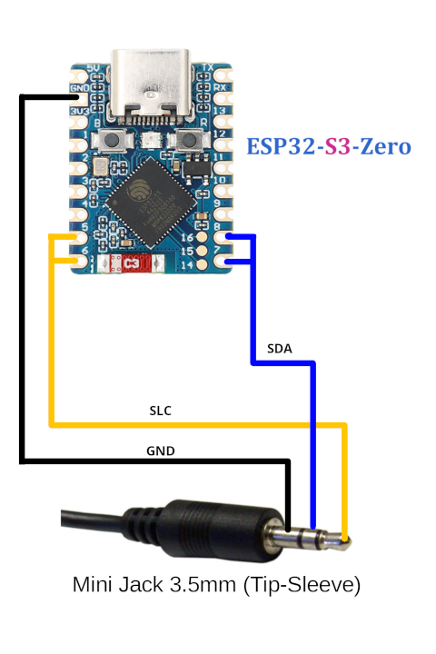

# DGT3000 BLE Gateway

This project implements a Bluetooth Low Energy (BLE) gateway for the DGT3000 chess clock, built for the ESP32 platform. It acts as a bridge, allowing a BLE client (such as a mobile/pc application) to communicate with and control a DGT3000 clock using a simple, JSON-based protocol.

This gateway handles the complex dual-I2C communication required by the clock and exposes a clean, modern BLE interface.

## Features

-   **BLE Service**: Exposes a standard GATT service for controlling the clock.
-   **JSON-Based Protocol**: Simple and extensible command/response protocol.
-   **Asynchronous Event Notifications**: Receive real-time updates for button presses, lever moves, and time changes.
-   **Dual-Core Architecture**: Utilizes FreeRTOS tasks to separate BLE communication (Core 1) from the time-sensitive I2C communication (Core 0) for robust performance.
-   **Status and Diagnostics**: Provides a status characteristic to monitor the gateway's health, including connection states, memory usage, and more.
-   **Auto-Recovery**: Includes logic to automatically attempt reconnection with the DGT clock if the connection is lost.
-   **Status LED**: Provides visual feedback on the operational state (waiting for connection, client connected, DGT ready).

## Hardware Requirements

-   **ESP32-S3-Zero** (or a compatible ESP32 board).
-   **DGT3000 Chess Clock**.
-   Wiring to connect the ESP32 to the DGT3000's I2C port (jack).

## Firmware Upload

To upload the firmware to your ESP32-S3-Zero, please use the following web flasher tool:

[https://dgt3000-gw.tednet.fr/flasher/](https://dgt3000-gw.tednet.fr/flasher/)

Follow the on-screen instructions on the website to flash the firmware onto your device.

## Wiring Instructions

To connect your ESP32-S3-Zero to the DGT3000's jack, follow the wiring diagram below:

*   **ESP32 Pin 5 and 6 (SCL)** connects to the **SCL** line of the 3.5mm jack.
*   **ESP32 Pin 7 and 8 (SDA)** connects to the **SDA** line of the 3.5mm jack.
*   **ESP32 GND** connects to the **GND** of the 3.5mm jack.

Please ensure all connections are secure before powering on the devices.

## Testing the Gateway

This project includes a powerful Python-based command-line client for testing and interaction, located in the `/test_client` directory.

### Features

-   **Interactive Mode**: Control the clock in real-time with simple commands.
-   **Detailed Logging**: See all BLE communication (commands, responses, events) in a color-coded interface.

For detailed instructions on how to set up and use the test client, please refer to its dedicated README file:

## Project Structure

-   `src/`: Contains the main implementation files for the different managers and the main application logic.
-   `include/`: Header files defining the classes, data structures, and constants.
-   `lib/`: Contains libraries, including the core `DGT3000` driver.
-   `doc/`: Project documentation, including the BLE protocol definition.
-   `test_client/`: A Python-based CLI for testing the gateway.
-   `platformio.ini`: The main configuration file for PlatformIO.

## Communication Protocol

All communication between a BLE client and this gateway is handled via a JSON-based protocol over BLE. For detailed information on the service UUIDs, characteristics, command formats, and event structures, please refer to the official protocol documentation:

**[Protocol Documentation](./doc/PROTOCOL.md)**

This document is the single source of truth for developing a client application to interact with this gateway.

## License

This project is licensed under the GNU General Public License v3.0. See the [LICENSE](https://www.gnu.org/licenses/gpl-3.0.html) file for details.

---

*This project was developed by Tortue, 2025.*

